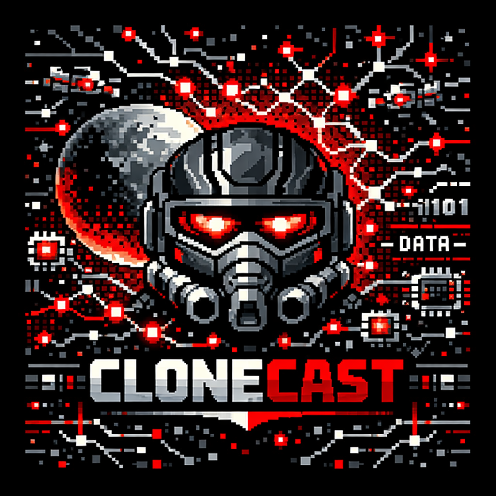

    Preview do podcast

    <audio src="output/podcast_editado.MP3" controls title="Podcast editado"></audio>

# Projeto Podcast Gerado por I.A.s

>Projeto com o objetivo de gerar um podcast utilizando ferramentas de IA através de prompts mais trabalhado.

## 💻 Tecnologias utilizadas no projeto:

- [Gemini](https://gemini.google.com//) 
- [Copilot](https://copilot.microsoft.com/)
- [ElevenLabs](https://beta.elevenlabs.io/)
- [Capcut](https://www.capcut.com/pt-br/)

## ✨ Prompts utilizados:

#### Prompt para a criação do nome do podcast 
* Você é um roteirista de um podcast e vamos criar um podcast de tecnologia, focado em inteligência artificial (IA), e eu gostaria da sua ajuda para criar 5 sugestões de nomes criativos para um podcast de IA com algum trocadilho nerd no nome. O podcast vai falar sobre dicas e novidades no mundo da IA, mostrando como esse meio está em constante evolução e sobre dicas de como usar, melhores IAs disponíveis, sobre como melhorar os prompts, entre outros.
  * {REGRAS}
    * Quero um nome enxuto. um nome e um subtítulo.
    * O nome deve ter algum trocadilho nerd com nomes de franquias, como star wars, harry potter, senhor dos anéis ou percy jackson.
    * O nome deve conter uma palavra forte que remeta a IA.
  * {REGRAS NEGATIVAS}
    * Não quero que o nome tenha palavras em inglês.
    * Não quero um nome genérico.

#### Prompt para a criação do roteiro
* Você é um roteirista de podcast e vamos criar um roteiro de um podcast tecnológico focado em inteligência artificial cujo o nome é "CloneCast -  prompts e poder: o verdadeiro jogo da inteligência artificial" e tem foco em IA com o público alvo de iniciantes no mundo da ia.
  * O formato do roteiro deve ser 
    * [INTRODUÇÃO]
    * [CURIOSIADE 1]
    * [CURIOSIDADE 2]
    * [FINALIZAÇÃO]
  * {REGRAS}
    * No bloco [INTRODUÇÃO] substitua por uma introdução iguais as introduções dos vídeos do canal 'ei nerd', como se fossem escritos pelo Peter Jordan.
    * No bloco [CURIOSIDADE 1] substitua por um comparativo direto entre as 3 melhores IAs de texto do momento (as mais famosas) e qual usar para cada objetivo.
    * No bloco  [CURIOSIDADE 2] sobre uma análise sobre as novas ferramentas de clonagem de voz e criação de avatares digitais.
    * No bloco [FINALIZAÇÃO] substitua por uma despedida cool/legal com o final "Eu sou Gisely Lavigne e foi o CloneCast dessa semana"
    * Use termos de fácil explicação.
    * O podcast vai ser apresentado somente por uma pessoa chamada Gisely Lavigne.
    * o podcast deve ser curto.
  * {REGRAS NEGATIVAS}
    * NÃO USE MUITOS TERMOS TÉCNICOS
    * Não ultrapasse 5 minutos de duração

#### Prompt para a criação da capa
* Crie uma capa baseando-se no título "CloneCast - prompts e poder: o verdadeiro jogo da inteligência artificial". Dimensão de 1:1. Estilo pixelart, com foco nas cores vermelho, preto, branco e cinza. Adicione elemetos que lembrem a inteligência artificial.
